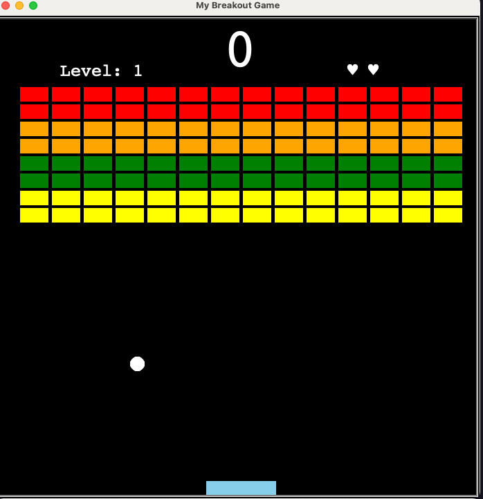
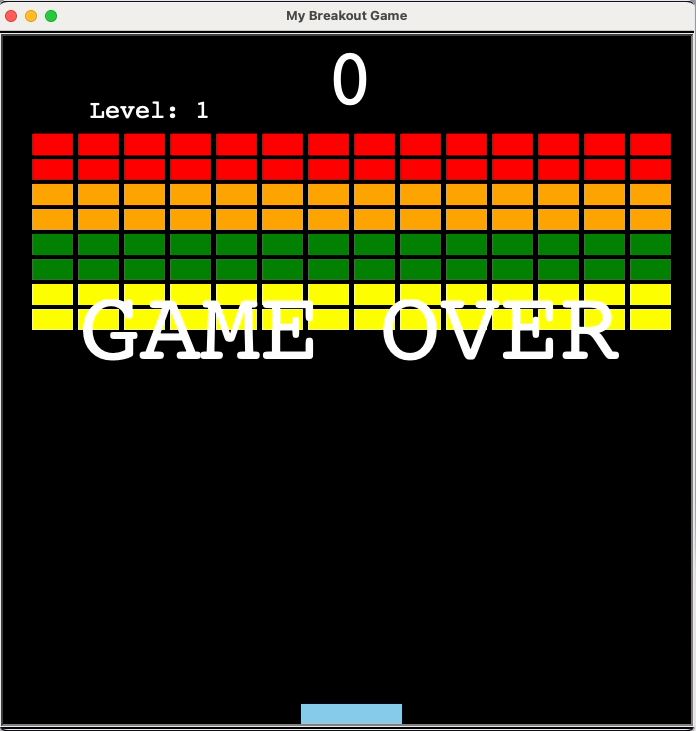

# Breakout Game

Implementing the [Breakout Game](https://en.wikipedia.org/wiki/Breakout_(video_game)) in python using the Turtle module.

## Usage

To run the game:
```
poetry run python main.py
```

To play, use the left and right arrow keys to move the paddle.

## Screenshots



